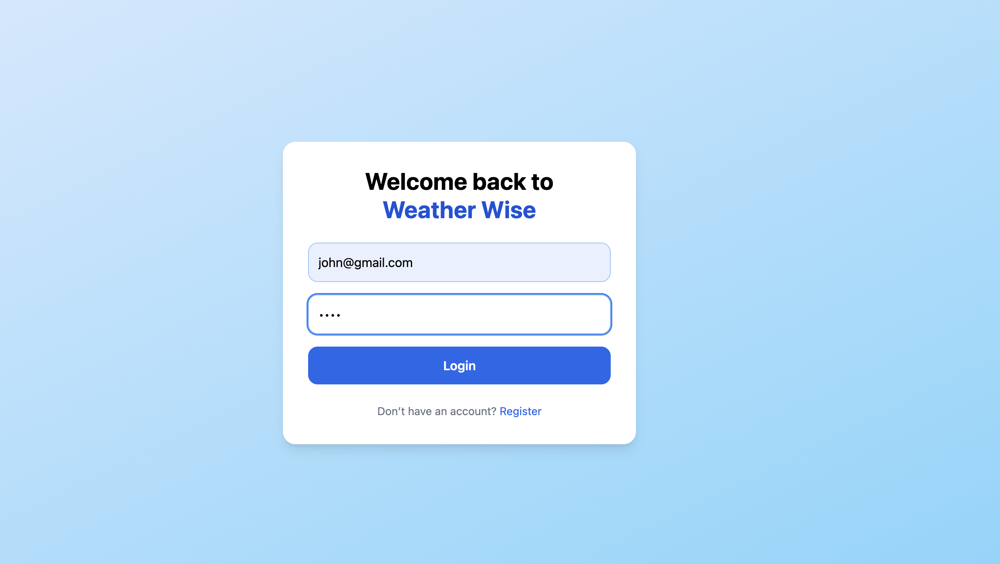

# 🌤️ WeatherWise

**WeatherWise** is a modern full-stack weather web application that allows users to search any city worldwide and view accurate, real-time weather data.  
It smartly integrates multiple weather providers with automatic fallback for maximum reliability.

---

## 🌍 Live Concept

- Search weather by **city name**
- Fetch real-time **forecast & conditions**
- Secure **authentication system**
- Clean, fast, and responsive UI
- Reliable weather data even without paid APIs

---

## ✨ Key Features

- 🔍 City-based weather search
- 🌦️ Real-time weather & forecast
- 🔄 Automatic provider fallback system
- 🔐 User registration & login
- 🪪 JWT-based authentication
- 💾 PostgreSQL database
- ⚡ Blazing fast frontend with Vite
- 🎨 Tailwind CSS styling
- 🧠 Clean backend architecture

---

## 🧰 Tech Stack

### Frontend
- **React 18**
- **Vite**
- **TypeScript**
- **Tailwind CSS**
- **Zustand** (state management)
- **React Router**
- **Axios**
- **Lucide React Icons**

### Backend
- **Node.js**
- **Express.js**
- **Prisma ORM**
- **PostgreSQL**
- **JWT Authentication**
- **bcrypt**
- **node-fetch**

---

## 🏗️ Architecture Overview

Frontend (React + Vite)
|
| Axios (REST API)
|
Backend (Express + Prisma)
|
| Weather Providers
| - WeatherAPI
| - OpenWeather
| - Open-Meteo (fallback)
|
PostgreSQL Database

---

## ⚙️ Environment Variables

Rename .env.example to .env
and add your relevant keys and db url

🚀 Getting Started
1️⃣ Clone Repository
git clone https://github.com/your-username/weatherwise.git
cd weatherwise

2️⃣ Backend Setup
cd backend
npm install

Generate Prisma client & migrate DB:

npx prisma generate
npx prisma migrate dev

Start backend server:

npm run dev

Backend runs at:

http://localhost:5000

3️⃣ Frontend Setup
cd frontend
npm install
npm run dev

Frontend runs at:

http://localhost:5173

🔐 Authentication API
➕ Register User
POST /auth/register

Request

{
  "email": "user@example.com",
  "password": "password123",
  "name": "John Doe"
}

Response

{
  "token": "JWT_TOKEN",
  "user": {
    "id": 1,
    "email": "user@example.com",
    "name": "John Doe"
  }
}

🔑 Login User
POST /auth/login

🌦️ Weather API Endpoints
🌍 Geocode City
GET /weather/geocode?q=London

☁️ Get Weather Forecast
GET /weather/forecast?lat=51.5072&lon=-0.1276

Response

{
  "provider": "weatherapi | openweather | open-meteo",
  "data": { }
}

🧠 Smart Provider Fallback Logic

WeatherWise automatically chooses the best provider:

WeatherAPI (if key exists)

OpenWeather (if key exists)

Open-Meteo (default fallback)

This ensures:

✅ High availability

✅ No vendor lock-in

✅ Works even without paid APIs

📸 Screenshots

📌 Roadmap / Future Improvements

⭐ Favorite cities

📊 Weather charts & trends

🔔 Severe weather alerts

🧪 Unit & integration tests

🐳 Docker support

☁️ Deployment (Vercel + Render)

🤝 Contributing

Contributions are welcome!

Fork the repo

Create a new branch

Commit your changes

Open a Pull Request 🚀

📄 License

This project is licensed under the MIT License.

🙌 Acknowledgements

Open-Meteo

WeatherAPI

OpenWeather

Prisma, Vite & React communities

⭐ Support

If you like this project, please star ⭐ the repository — it helps a lot!

---

If you want next, I can:
- Write a **perfect GitHub repo description**
- Optimize it for **recruiters / portfolio**
- Add **Docker + deployment docs**
- Create a **CONTRIBUTING.md**

Just tell me 💪
